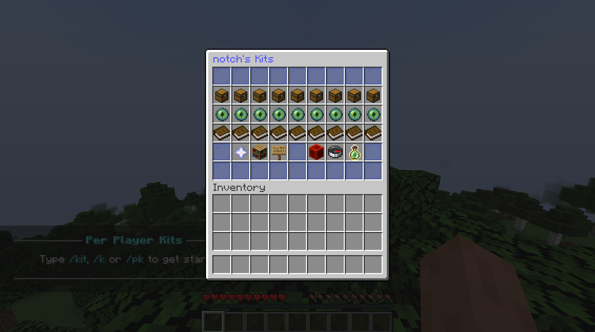

# PerPlayerKit

Join the discord for more information and support: [Discord](https://discord.gg/5djuBSKWuV)

## 🚀 Quick Start

New to PerPlayerKit? Check out our [Simple Setup Guide](./SIMPLE_SETUP_GUIDE.md) for a step-by-step walkthrough that gets you up and running in minutes!

## License: AGPLv3

PerPlayerKit is open source and licensed under the terms of the [GNU Affero General Public License v3. 0](./LICENSE). Read and understand the license before using this software. [Frequently Asked Questions about the GNU Licenses](https://www.gnu.org/licenses/gpl-faq.html#AGPLv3InteractingRemotely).

## Contributing to PerPlayerKit

If you would like to contribute to the project you can do so by forking the repository and submitting a pull request. We prefer that improvements and contributions be merged into the main branch, rather than spread across numerous forks.

## About the plugin

PerPlayerKit is a [PaperMC](https://papermc.io/) plugin that allows players to make their own unique kits to PvP with. Administrators create a set of items in the "Virtual Kit Room", from which players pick their items. They can then make up to 9 kits each with can be shared, modified, and inspected by moderators. It features a GUI for simple kit usage of the plugin. Additionally, commands can be used to quickly load kits and for moderator features. It also features protections against abusive items, limiting NBT data and enchantments to what is available in vanilla Minecraft and only allowing items that can be found in the "virtual kit room". Players can also use the plugin to create enderchest kits that will be loaded into their enderchest when they select the enderchest kit.

## Dependencies

PerPlayerKits uses a minecraft GUI library called canvas, it can be found [here](https://github.com/IPVP-MC/canvas). PerPlayerKits was supports version 1.19 and above.

## Installation

PerPlayerKits has a minimal configuration just requiring selecting the database type. PerPlayerKit supports both MySQL/MySQL compatible (MariaDB) databases and SQLite databases. If you don't know what you are doing or don't have access to a database, use `sqlite` as the database type.

To use the plugin run the server with the plugin in the "plugins" folder, then stop the server and edit the config.yml file in the "plugins/PerPlayerKits" folder.

More configuration options are available, please refer to the [configuration documentation](./CONFIG.md).

## Commands and Permissions

For detailed information on commands and permissions, please refer to the [command documentation](./COMMANDS.md).

## External API

PerPlayerKit has a simple API that allows developers to interact with the plugin. The API is **NOT** stable and will possibly change in the future. Please refer to the [API documentation](./API.md) for more information.
