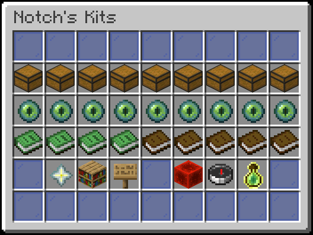

# PerPlayerKit

The kit plugin powering modern PvP practice servers.

**[Documentation](https://perplayerkit.com)** · **[Download](https://modrinth.com/plugin/perplayerkit)** · **[Discord](https://discord.gg/5djuBSKWuV)**

  

 

Most kit plugins give everyone the same loadout. PerPlayerKit gives every player their own.

You stock a **kit room** with the items you approve. Players pick from it, build nine kits each by default, and load one with `/k1`. Kits can be shared, inspected by staff, and restocked mid-fight.

## Get started

1. **[Install it](https://perplayerkit.com/installation)**. Drop in the jar, pick a database, restart.
2. **[Set up your kit room](https://perplayerkit.com/kit-room)**. Choose the items players can use.
3. **[Give out permissions](https://perplayerkit.com/permissions-setup)**. Grant `perplayerkit.use` and you are done.

Needs Paper or Spigot 1.19+ and Java 17+.

## Documentation

Everything lives at **[perplayerkit.com](https://perplayerkit.com)**.

|                                                                            |                                              |
| -------------------------------------------------------------------------- | -------------------------------------------- |
| [Commands](https://perplayerkit.com/commands/players)                      | Every command for players, staff, and admins |
| [Permissions](https://perplayerkit.com/commands/permissions)               | Every node, plus recipes for common setups   |
| [config.yml reference](https://perplayerkit.com/settings/config-reference) | Every setting and what it does               |
| [Troubleshooting](https://perplayerkit.com/help/troubleshooting)           | Fixes for the problems people hit most       |
| [FAQ](https://perplayerkit.com/help/faq)                                   | Short answers to common questions            |
| [Java API](https://perplayerkit.com/api)                                   | For plugin developers                        |

## Download

| Where      |                                                         |
| ---------- | ------------------------------------------------------- |
| Modrinth   | https://modrinth.com/plugin/perplayerkit                |
| SpigotMC   | https://www.spigotmc.org/resources/perplayerkit.121437/ |
| Hangar     | https://hangar.papermc.io/noah32/PerPlayerKit           |
| Dev builds | https://jenkins.noah.dev/job/PerPlayerKit/              |

Dev builds come from every commit on `main` and are untested. Back up your kit data before running one in production.

## Help

Join the **[Discord](https://discord.gg/5djuBSKWuV)** for setup help. Report bugs on the [issue tracker](https://github.com/rossnoah/PerPlayerKit/issues).

## Contributing

Fork the repository and open a pull request against `main`. We would rather merge improvements than see them spread across forks.

Documentation source is in [`docs/`](./docs). See [docs/README.md](./docs/README.md).

## License

PerPlayerKit is licensed under the [GNU Affero General Public License v3.0](./LICENSE).

[PlaceholderAPI](https://www.spigotmc.org/resources/placeholderapi.6245/) and [WorldGuard](https://enginehub.org/worldguard) are optional integrations.
