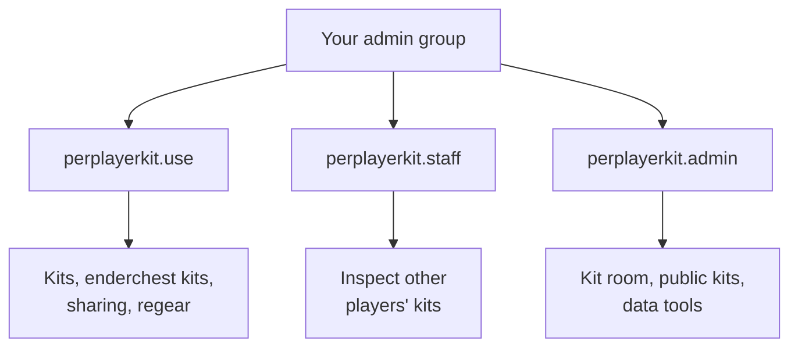

Every command has its own <Tooltip tip="The exact permission string a plugin checks, such as perplayerkit.use.">node</Tooltip>. PerPlayerKit works with <Tooltip tip="The free permissions plugin most Minecraft servers run.">LuckPerms</Tooltip> and any other Bukkit permissions plugin.

## The three bundles

| Bundle | Covers |
| ------ | ------ |
| `perplayerkit.use` | Every normal player command |
| `perplayerkit.staff` | `/inspectkit` and `/inspectec` |
| `perplayerkit.admin` | Kit room, public kits, purge, export, import, migrate |



<Warning>
  `perplayerkit.admin` includes staff inspection and kit room editing. It does **not** grant `perplayerkit.use`; add that for player features.
</Warning>

## Short names

| Short name | Grants |
| ---------- | ------ |
| `kit.use` | `perplayerkit.use` |
| `kit.staff` | `perplayerkit.staff` |
| `kit.admin` | `perplayerkit.admin` |

## What `perplayerkit.use` contains

| Group | Nodes |
| ----- | ----- |
| Kits | `perplayerkit.menu`, `perplayerkit.kit`, `perplayerkit.publickit`, `perplayerkit.swapkit`, `perplayerkit.deletekit` |
| Enderchest kits | `perplayerkit.enderchest`, `perplayerkit.viewenderchest`, `perplayerkit.deleteenderchest` |
| Sharing | `perplayerkit.copykit`, `perplayerkit.sharekit`, `perplayerkit.shareenderchest`, `perplayerkit.transferkits` |
| In a fight | `perplayerkit.regear`, `perplayerkit.heal`, `perplayerkit.repair`, `perplayerkit.rekitonrespawn`, `perplayerkit.rekitonkill` |

Notifications use the separate `perplayerkit.kitnotify` permission, which defaults to operators. Commands and menus check the same action permissions.

## Every node

| Node | Unlocks |
| ---- | ------- |
| `perplayerkit.menu` | `/kit` |
| `perplayerkit.kit` | `/k1` to `/k<max>` |
| `perplayerkit.publickit` | `/publickit` |
| `perplayerkit.viewenderchest` | `/enderchest` |
| `perplayerkit.enderchest` | `/ec1` to `/ec<max>` |
| `perplayerkit.copykit` | `/copykit`, `/shareaccept`, `/sharedecline` |
| `perplayerkit.sharekit` | `/sharekit` |
| `perplayerkit.shareenderchest` | `/shareec` |
| `perplayerkit.transferkits` | `/transferkits` |
| `perplayerkit.swapkit` | `/swapkit` |
| `perplayerkit.deletekit` | `/deletekit` |
| `perplayerkit.deleteenderchest` | `/deleteec` |
| `perplayerkit.editkitroom` | Saving kit room pages |
| `perplayerkit.regear` | `/regear`, `/rg` |
| `perplayerkit.heal` | `/heal` |
| `perplayerkit.repair` | `/repair` |
| `perplayerkit.rekitonrespawn` | Getting a kit back on respawn |
| `perplayerkit.rekitonkill` | Getting a kit after a kill |
| `perplayerkit.staff` | `/inspectkit`, `/inspectec` |
| `perplayerkit.admin` | `/kitroom`, `/savepublickit`, `/purgeitem`, `/kitdata`, `/perplayerkit` |
| `perplayerkit.kitnotify` | Seeing kit broadcasts. Defaults to operators; grant it separately for other players. |

To turn broadcasts off server-wide, see [Messages and broadcasts](/settings/messages).

## Recipes

### Players build kits but cannot share them

```bash
/lp group default permission set perplayerkit.use true
/lp group default permission set perplayerkit.sharekit false
/lp group default permission set perplayerkit.shareenderchest false
/lp group default permission set perplayerkit.transferkits false
/lp group default permission set perplayerkit.copykit false
```

### Public kits only, no kit building

Skip the bundle and grant one node.

```bash
/lp group default permission set perplayerkit.publickit true
```

### Regear as a rank perk

```bash
/lp group default permission set perplayerkit.regear false
/lp group donor   permission set perplayerkit.regear true
```

### No kit broadcasts for one group

```bash
/lp group default permission set perplayerkit.kitnotify false
```
